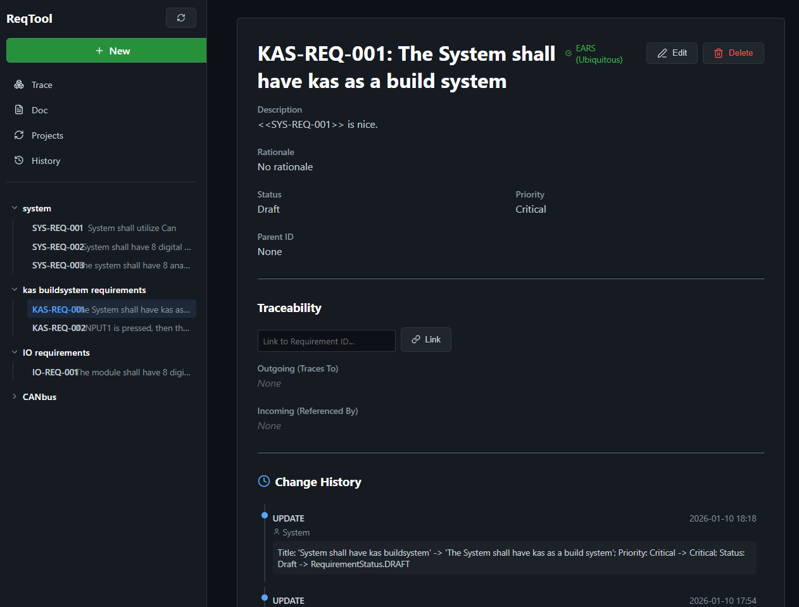

# ReqTool



A lightweight and powerful requirement management tool designed for modern engineering workflows, now enhanced with AI-assisted generation.

## Features

- **Requirement Management**: Create, edit, and organize requirements with ease.
- **AI-Assisted Generation**: Generate requirement descriptions and rationales automatically. Configurable model selection (e.g., Llama 3, Phi-3) via the Settings menu.
- **Visual Traceability Graph**: Interactive graph visualization of requirement relationships and dependencies.
- **Hierarchical Organization**: Group requirements by project with auto-numbering and build parent-child relationships.
- **Traceability Matrix**: Manage incoming and outgoing traces between requirements.
- **EARS Verification**: Real-time checking of requirements against the Easy Approach to Requirements Syntax (EARS) patterns.
- **History & Audit Logs**: Full tracking of change history for every requirement and a global system audit feed.
- **Export Capabilities**:
  - **AsciiDoc**: Generate comprehensive documentation with hierarchy and traceability.
  - **ReqIF**: Export requirements in the standard Requirements Interchange Format for tool interoperability, including traceability relations.
- **Open-WebUI**: Integrated dashboard for direct interaction with local LLMs.

## Technology Stack

- **Backend**: FastAPI (Python), SQLAlchemy, SQLite, Ollama Integration.
- **Frontend**: React, Vite, TypeScript, Lucide Icons.
- **Infrastructure**: Docker Compose, Bun (Frontend Build).

## Development

Developed using **Antigravity**, a powerful agentic AI coding assistant.

### Running with Docker (Recommended)

The easiest way to launch the entire stack is using Docker Compose:

1. **Prerequisite**: Ensure [Ollama](https://ollama.com/) is installed and running on your host machine with the `llama3:latest` model pulled:
   ```bash
   ollama pull llama3
   ```
2. Ensure Docker Desktop is running.
3. Run the following command from the root directory:
   ```bash
   docker compose up --build -d
   ```
4. Access the application:
   - **ReqTool Frontend**: [http://localhost](http://localhost)
   - **ReqTool Backend API**: [http://localhost:8000](http://localhost:8000)
   - **Open-WebUI**: [http://localhost:3000](http://localhost:3000)

The database will be stored in a persistent Docker volume named `db-data`.

### Manual Setup

If you prefer to run the components manually:

#### Backend

1. Navigate to `backend/`
2. Create and activate a virtual environment.
3. Install dependencies: `pip install -r requirements.txt`
4. Start the server: `python -m uvicorn main:app --reload`

#### Frontend

1. Navigate to `frontend/`
2. Install dependencies: `bun install`
3. Start the dev server: `bun dev`
